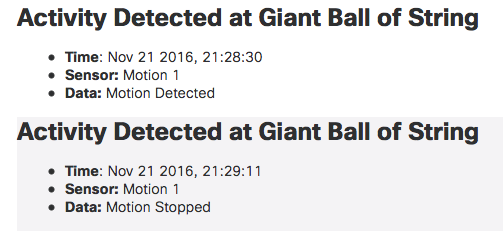

# Giant Ball of String: IOx

Giant Ball of String (GBoS) is a sample demonstration applicaiton that illustrates how several technologies from Cisco can be brought together to address a business problem.  

## Demo Application Background

All across the United States, there are roadside attractions like *The Worlds Largest Fork*, *The Biggest Donut*, and *The Giant Ball of String*.  The organization that manages these attractions is facing pressure to provide better metrics and details about the visitors to the attractions, and to provide a better experience for those visitors.  If they can't meet this demand, they may see their funding reduced.  

To address this problem, the technical staff has built their next generation attraction support platform.  This platform provides the following capabilities:

* Monitor activity at each site using motion detectors.  
* Turn on lights, signage, and resources at each site only when vistors are present
* Provide centralized logging of visits at all attractions
* Informational Kiosks at each attraction 
* Direct interaction with visitors by providing facts and Q/A through their mobile devices

## Full Demo Details

This repository and README provide details on setting up just the gbos_iox code and deployment.  More details available at: 

* [gbos_demo](https://github.com/imapex/gbos_demo) - Full Demo Application Setup and Details
* [gbos_iox](https://github.com/imapex/gbos_iox) - Details on the Cisco IOx Client Application 
* [gbos_arduino](https://github.com/imapex/gbos_arduino) - Details on the Arduino Microcontroller Code 
* [gbos_kiosk](https://github.com/imapex/gbos_kiosk) - Details on the Welcome Web Portal Page
* [gbos_tropo](https://github.com/imapex/gbos_tropo) - Details on the Tropo Service for SMS based communication with visitors

---

# gbos_iox 

This repository provides the code and details for the Cisco IOx Application that monitors motion detection from [gbos_arduino](https://github.com/imapex/gbos_arduino) and takes appropriate actions (ie logging activity and notifying administrators).  The Cisco Router running gbos_iox is connected via Serial to an Arduino running the [gbos_arduino](https://github.com/imapex/gbos_arduino) and configured for the proper circuit.  

### Table of Contents 

* [Setup and PreRequisites](#setup-and-prerequisites)
* [Loading Demo Application](#loading-demo-application)
* [Connecting the Arduino and Router](#connecting-the-arduino-and-router)

# Setup and PreRequisites 

To build and replicate this demonstration you'll need access to an IOx device with a Serial Port, and a compatible Arduino device.  The original demonstration was created using a **Cisco C819HG-4G-G-K9** router and an **Arduino UNO**, however other models of each could be used.  

## IOx Router/Host 

[Cisco DevNet IOx Community](https://developer.cisco.com/site/iox/index.gsp) is the best place for resources on developing with IOx.  Before beginning this, or any other IOx app project, you can find information on preparing your router.  This includes: 

* installing the correct IOS image 
* configuing IOS to enable IOx 
* loading the neccessary cartridges for running applications

This demonstration runs as a Python PaaS application, so follow the [PaaS QuickStart](https://developer.cisco.com/media/iox-dev-guide-7-12-16/getstarted/quickstart-paas/) preperation for that demonstration.  

### Serial Port 

Because this demonstration uses the router's Serial Interface to connect to the Arduino, you'll need: 

* Additional configuration to enable the mapping of the Serial Interface to the IOx application
	* See this link for information [Cisco ISR 8xx - Enabling Serial Port](https://developer.cisco.com/media/iox-dev-guide-7-12-16/platforms/platform-isr8xx/#enabling-serial-port)
* A compatible Serial cable for your router that exposes the TX/RX pins to conenct to the Arduino.  

#### SmartSerial Interface Cable Option

The Cisco C819HG-4G-G-K9 router, and several others, leverage a SmartSerial interface on the Serial Interface.  To leverage this port, you can order a SmartSerial to RS232/DB25 cable that can be used to gain access to a standard serial interface.  That cable coupled with a DB25 breakout board makes it very easy to interconnect with the Ardunio.  

**Sample Parts List**

| Description | Part Number | Sample Link |
| ----------- | ----------- | ----------- |
| SmartSerial to Female DB25 | CAB-SS-232FC | [Amazon](https://www.amazon.com/Cisco-Smart-Serial-Female-CAB-SS-232FC/dp/B0064CQWDW/ref=sr_1_1?ie=UTF8&qid=1473424993&sr=8-1&keywords=smart+serial+to+db25) |
| Male DB25 Breakout Board | N/A | [Amazon](https://www.amazon.com/Swellder-Connector-25-pin-Terminal-Breakout/dp/B00V7S79BW/ref=sr_1_2?s=electronics&ie=UTF8&qid=1473425100&sr=1-2&keywords=db25+breakout) |

*Links to Amazon above are purely for reference.  We will receive no money if you use them.*

If you use a Female DB25 interface, the pins that you'll need are:

* **Pin 2 - Receive** connected to **RS232 Shifter Pin 2: Tx**
* **Pin 3 - Transmit** connected to **RS232 Shifter Pin 3: Rx** 
* **Pin 7 - Ground** connected to **RS232 Shifter Pin 5: Ground**

## Alerting Options 

Notifications and alerts of activity can be sent and recorded using Cisco Spark and/or Cisco Zeus.  The recommendation is to leverage both alerting options to hightlight real-time (Spark) and historical (Zeus) within the demonstration.  

You'll need to have accounts with the services you plan to use.  

### Cisco Spark 

Visit [CiscoSpark.com](http://ciscospark.com) to register for an account.  This takes only a few minutes to complete.  

### Cisco Zeus 

Visist [CiscoZeus.io](https://ciscozeus.io) to register for an account.  This process can take a few days to complete.    

# Loading Demo Application

Begin by cloning the gbos_iox repository to your local machine.  

```
git clone https://github.com/imapex/gbos_iox

# Change to the gbos_iox directory
cd gbos_iox/

# View the contents of the repo, you shoudl see something similar
ls
LICENSE     resources        README.md      iox_app

```

## IOx PaaS Application

Follow these steps to properly package and deploy gbos_iox to your device.  This assumes you already have installed and setup ioxclient on your local machine.  For information on how to do that, see [ioxclient-reference](https://developer.cisco.com/media/iox-dev-guide-7-12-16/ioxclient/ioxclient-reference/) on DevNet.  

*All of these steps will be accomplished from a terminal on your workstation*

1. Enter the iox_app directory.  You should see the following files.  

	```
	cd iox_app/
	```
	
	| File | Description |
	| --- | --- | 
	| package.yaml | YAML formated description of the IOx application |
	| sample_package_config.ini | Application configuration file (empty) | 
	| device_mapping.json | Host Router Device Mapping (ie network and serial) | 
	| requirements.txt | Python requirements list | 
	| main.py | Python code to run for application | 
	

2. The `sample_package_config.ini` file is a template for the required configuraiton file for the IOx application.  Make a copy of this file that you will customize for your deployment.  

    ```
    cp sample_package_config.ini package_config.ini
    ```
    
3. Open the newly created `package_config.ini` file and update it as indicated here.  

```
[info]
location_name: Giant Ball of String
location_id: 001
location_contact_email: <your email>    <-- Insert your email address

[print]
enabled: True
logging: True

[spark]
enabled: True
logging: False
url: https://api.ciscospark.com
token: <spark token>                    <-- Provide a Spark Token for Alerts to be sent from
room_id: <spark room id>                <-- Provide a Spark RoomID for Alerts to be sent to

[zeus]
enabled: True
logging: False
url: http://api.ciscozeus.io            <-- Verify that this API url with Zeus
token: <zeus token>                     <-- Provide a Zeus Token
log_name: <log name>                    <-- What Log Name to post to (alpha numeric)
log_key: <log key>                      <-- What Log Key for alerts (alpha numeric)

[motionsensor]
compare_data: 0
serial_dev: <serial device for testing from laptop>     <-- Local /dev/cu.usbmodem### for your Arduino
logging: False
enabled: True

[logging]
# DEBUG:10, INFO: 20, WARNING: 30, ERROR: 40, CRITICAL: 50, NOTSET: 0
log_level: 10
# Enable/disable logging to stdout
console: yes
```    

2. Create an IOx application package that can be installed to your host device.  

	```
	ioxclient package .
	
	Currently active profile :  default
	Command Name: package
	Checking if package descriptor file is present..
	Created Staging directory at :  /var/folders/dh/t0frtgx514388l6ycj2bl7740000gn/T/238313704
	Copying contents to staging directory
	Checking for application runtime type
	Detected Python application. Attempting to install dependencies present in requirements.txt ..
	Collecting pyserial (from -r requirements.txt (line 1))
	  Using cached pyserial-3.1.1-py2.py3-none-any.whl
	Installing collected packages: pyserial
	Successfully installed pyserial
	
	Successfully installed dependencies..
	Creating an inner envelope for application artifacts
	Excluding  package.tar
	Generated  /var/folders/dh/t0frtgx514388l6ycj2bl7740000gn/T/238313704/artifacts.tar.gz
	Calculating SHA1 checksum for package contents..
	Root Directory :  /private/var/folders/dh/t0frtgx514388l6ycj2bl7740000gn/T/238313704
	Output file:  /var/folders/dh/t0frtgx514388l6ycj2bl7740000gn/T/290598695
	Path:  artifacts.tar.gz
	SHA1 : ebb9550385ea63c33565c3f8e18bed9dfe0dfbf8
	Path:  package.yaml
	SHA1 : 2ca92ad2d72465d42ebdbfd3c7db2a2aa01d0f3a
	Path:  package_config.ini
	SHA1 : da39a3ee5e6b4b0d3255bfef95601890afd80709
	Generated package manifest at  package.mf
	Generating IOx Package..
	Created IOx package at :  /tmp/gbos_iox/iox_app/package.tar
	```

3. Install the gbos_iox package onto your router. 

	```
	ioxclient application install gbos_iox package.tar 
	
	Currently active profile :  default
	Command Name: application-install
	Installation Successful. App is available at : https://10.192.81.81:8443/iox/api/v2/hosting/apps/gbos_iox
	Successfully deployed
	```
	
	* Verify application installed.
		
		```
		ioxclient application list 
		
		Currently active profile :  default
		Command Name: application-list
		List of installed App :
		 1. gbos_iox   --->   DEPLOYED
		  
		```
	
4.  Update `device_mapping.json` Serial device name to match your router.  
	* Get the information about your router's interface. 

		```
		# List the devices avialable on your platform 
		ioxclient platform device list
		
		Currently active profile :  default
		Command Name: plt-device-list
		-------------Device Info----------------
		{
		 "serial": [
		  {
		   "available": true,				<--- Must show true
		   "device_id": "/dev/cpts0",		<--- This value for device_mapping.json
		   "device_name": "serial0",		<--- This indicates the router interface 
		   "port": 32000,
		   "slot": 0,
		   "used_by": null
		  }
		 ]
		}	
		```
	
	* Update `device_mapping.json` to use the correct serial_id.
	
		```
		cat device_mapping.json
		{
		  "resources": {
		    "cpu": "25",
		    "devices": [
		      {
		        "device-id": "/dev/cpts0",	<--- Update this to match
		        "label": "HOST_DEV1",
		        "type": "serial"
		      }
		    ],
		    "disk": "100",
		    "memory": "50",
		    "network": [
		      {
		        "interface-name": "eth0",
		        "network-name": "iox-bridge0"
		      }
		    ],
		    "profile": "custom"
		  }
		}	
		```

5. Activate gbos_iox application 

	```
	ioxclient application activate gbos_iox --payload device_mapping.json
	
	Currently active profile :  default
	Command Name: application-activate
	Payload file : device_mapping.json. Will pass it as application/json in request body..
	App gbos_iox is Activated	
	```
	
	* Check that gbos_iox is now activated
	
		```
		ioxclient application list
		Currently active profile :  default
		Command Name: application-list
		List of installed App :
		 1. gbos_iox   --->  ACTIVATED
		```

6. Start gbos_iox application.  

	```
	ioxclient application start gbos_iox 
	
	Currently active profile :  default
	Command Name: application-start
	App gbos_iox is Started
	```
	
7. Get the IP address assigned to gbos_iox
		
	```
	# Run this command to get the details of the started application
	# If no ipv4 address is displayed, wait a minute and re-run
	ioxclient application info gbos_iox 
	
	# Some output not displayed 
	Currently active profile :  default
	Command Name: application-info
	Details of App : gbos_iox
	-----------------------------
	{
	 "description": "Monitors External Arduino Sensor and writes collected sensor data to log files",
	 "name": "gbos_iox",
	 "networkInfo": {
	  "eth0": {
	   "ipv4": "192.168.1.16",				<--- This is the IP Address for gbos_iox
	   "ipv6": null,
	   "libvirt_network": "dpbr_0",
	   "mac": "52:54:DD:EE:D7:BF",
	   "mac_address": "52:54:dd:ee:d7:bf",
	   "network_name": "iox-bridge0",
	   "port_mappings": {
	    "tcp": [
	     [6000,6000]							<--- The TCP port for gbos_iox 
	    	]
	   }
	  }
	 },
	 "resources": {
	  "cpu": 25,
	  "devices": [
	   {
	    "device-id": "/dev/cpts0",		<--- Note the Serial Interface
	    "label": "HOST_DEV1",
	    "type": "serial",
	    "usage": "Integrating with Arduino"
	   }
	  ]
	 },
	 "state": "RUNNING",
	}	

	```

8. If you've configured your IOx Platform in the default mode where the IOx Guest OS is NAT'd to the WAN interface, you'll need to install a Static NAT entry for port 6000 to the gbos_iox IP Address assigned.  If your IOx Platform networking is configured in another way, you can skip this part.  
	1.  Login to IOS running on your router and enter config mode.  

		```
		iox#conf t
		
		! Replace 192.168.1.16 with the IP address assigned to gbos_iox 
		! If your Outside interface is NOT GigabitEthernet 0, replace it
		iox(config)#ip nat inside source static tcp 192.168.1.16 6000 interface GigabitEthernet0 6000
		iox(config)#exit
		
		! Verify the NAT Translation was configured 
		iox#show ip nat translations		
		Pro Inside global         Inside local          Outside local         Outside global
		tcp <- RTR IP ->:6000     192.168.1.16:6000     ---                   ---
		tcp <- RTR IP ->:2222     192.168.3.2:22        ---                   ---
		tcp <- RTR IP ->:8443     192.168.3.2:8443      ---                   ---		
		```

9. **NOT CURRENTLY IMPLEMENTED - NO INCOMING API CONFIGURED** With gbos_iox started, and NAT configured, you can now access the REST API to get a list of alerts.  

	```
	# Replace RTR_IP with your router's IP address
	curl RTR_IP:6000/
	
	[]
	
	# Currently no alerts have been logged
	```
	
10. Connect to the console of the running application to verify it has started correctly.  If you connect immediately after starting, you may need to wait while the container boots up completely.  

    ```
    ioxclient application console gbos_iox 
    
    # Sample Output
    Currently active profile :  default
    Command Name: application-console
    Console setup is complete..
    Running command : [ssh -p 2222 -i gbos_iox.pem appconsole@10.192.81.101]
    SSH client is not present on the platform.
    Attempting to connect using native SSH implementation..., press Ctrl+C to exit
    
    Connecting to appconsole@10.192.81.101:2222 using pem file gbos_iox.pem
    Connected to domain gbos_iox
    Escape character is ^]
    running
    Motion Sensor 1 Enabled...
    Print Alert Enabled for output...
    Spark Alert Enabled for output...
    # Activity Detected at Giant Ball of String
    * **Time**: Nov 21 2016, 19:54:47
    * **Sensor:** Motion 1
    * **Data:** Motion Detected    
    ```
	
# Running the Demo

With the both the PaaS application and the Arduino Sketch loaded and tested individually, now you will connect the two devices together for the full demo.  

## Connecting the Serial Devices Together

Depending on the exact type of Serial interface and cable you are using with your router, you may need to update these details.  But if your router serial cable provides a Female DB25 connector (as was used in this demo build) you will use these pin connections.  

* **Pin 2 - Receive** connected to **RS232 Shifter Pin 2: Tx**
* **Pin 3 - Transmit** connected to **RS232 Shifter Pin 3: Rx** 
* **Pin 7 - Ground** connected to **RS232 Shifter Pin 5: Ground**

## Testing

Once connected, when you trigger the motion detector on the Arduino, you should see a message similar to this on the iox applicaiton console.  

```
# Activity Detected at Giant Ball of String
* **Time**: Nov 21 2016, 19:54:47
* **Sensor:** Motion 1
* **Data:** Motion Detected    
```

If you correctly configured the Spark Token and Room within the `package_config.ini` file, you'll also receive a message in your Spark Client that looks like this.  

